 

## Laegna Atlas — I (Negotion Quadrant)

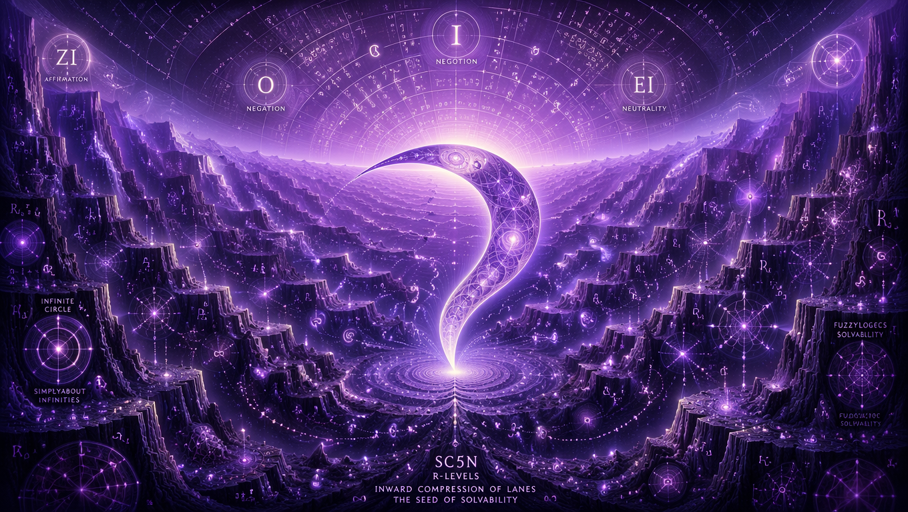

## Laegna Atlas — O (Negation Quadrant)

**Laegna-O**

## Laegna Atlas — A (Position Quadrant)

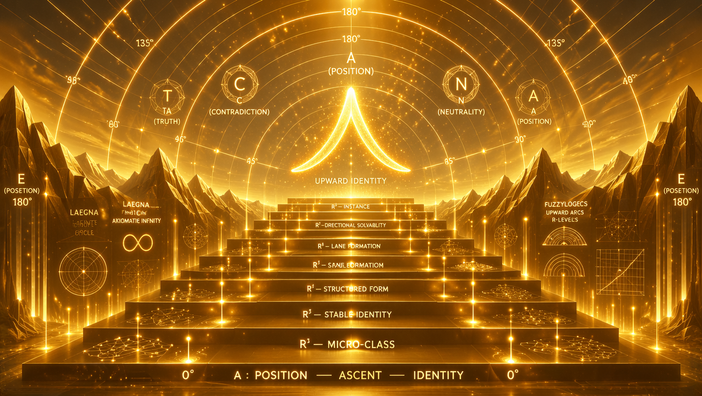

**Laegna-A**

## Laegna Atlas — E (Posetion Quadrant)

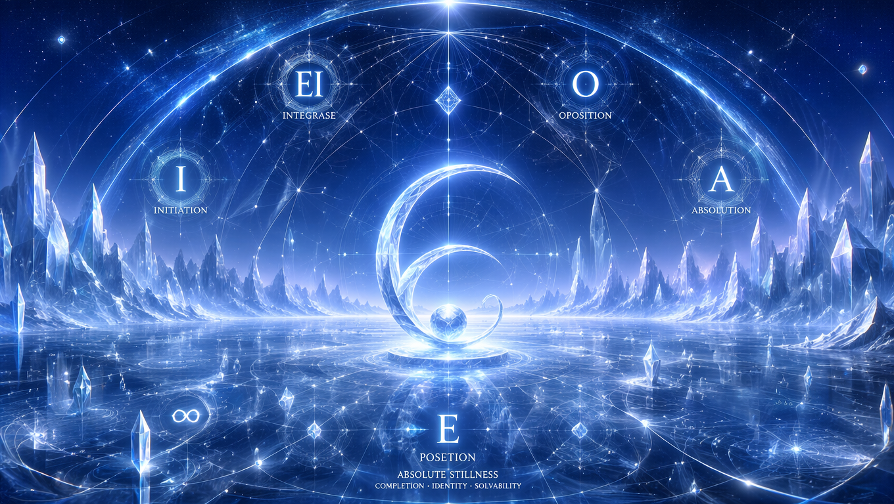

**Laegna-E**

## Laegna Atlas — Z-Regime (Logarithmic Geometry)

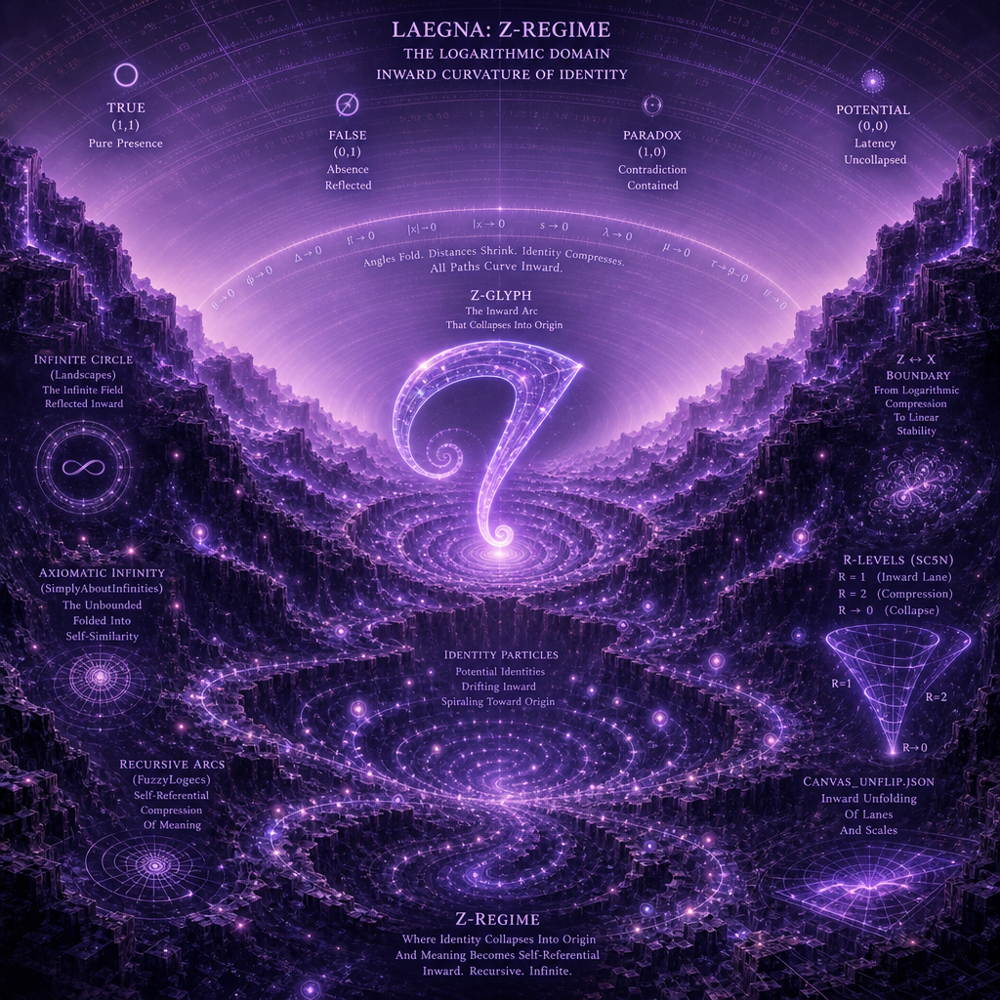

**Laegna-Z-Regime**

## Laegna Atlas — X-Regime (Linear Geometry)

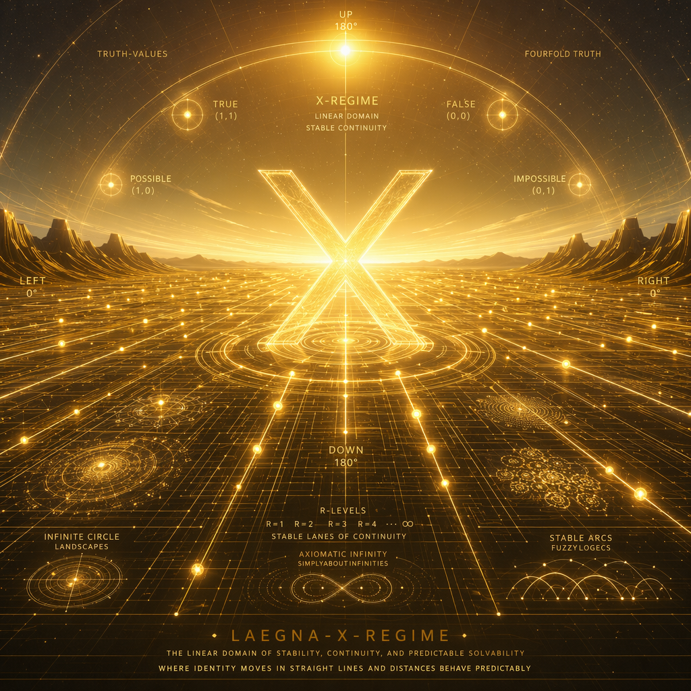

**Laegna-X-Regime**

## Laegna Atlas — Y-Regime (Exponential Geometry)

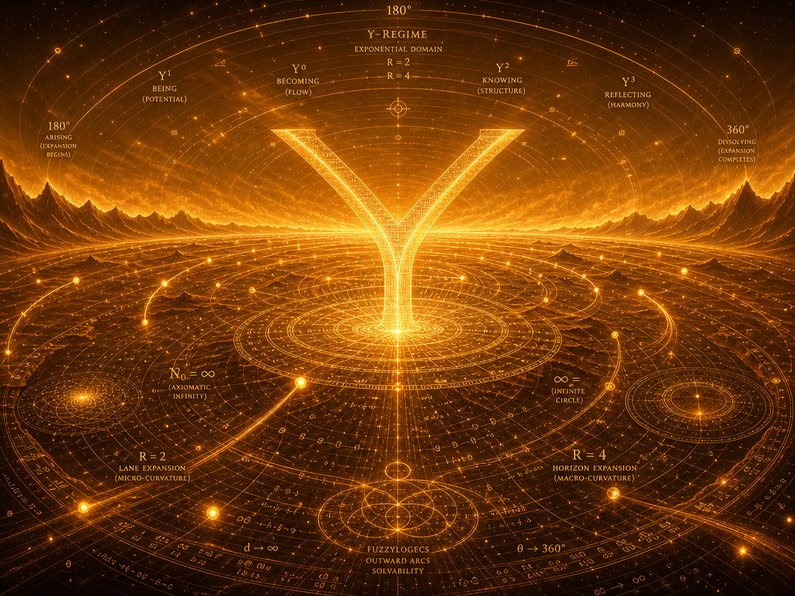

**Laegna-Y-Regime**

## Laegna Atlas — E-Regime (Exponent-Absolute Geometry)

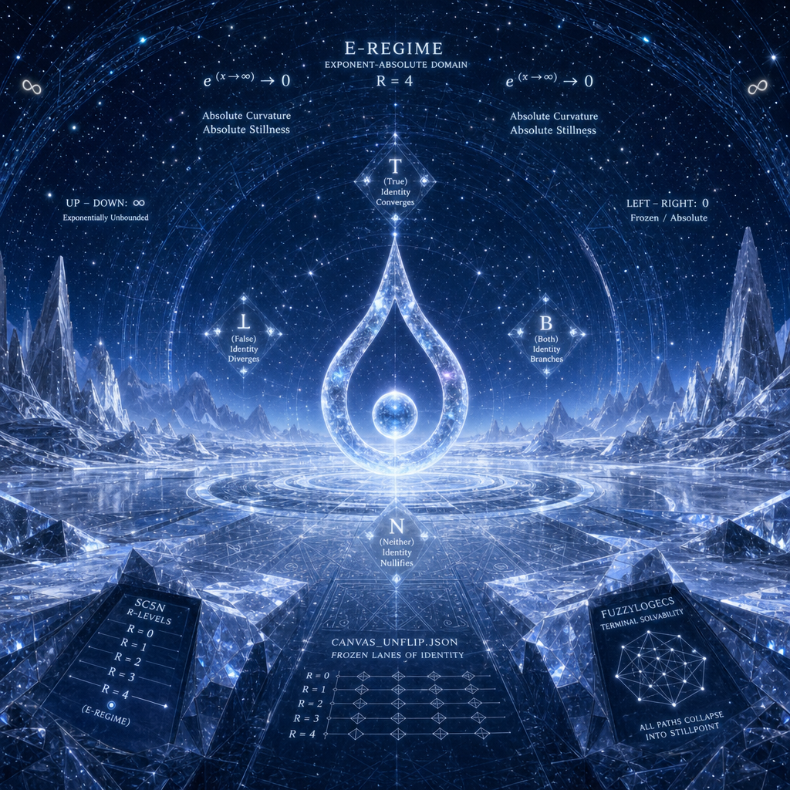

**Laegna-E-Regime**

## Laegna Atlas — Infinity (Abstract Mode)

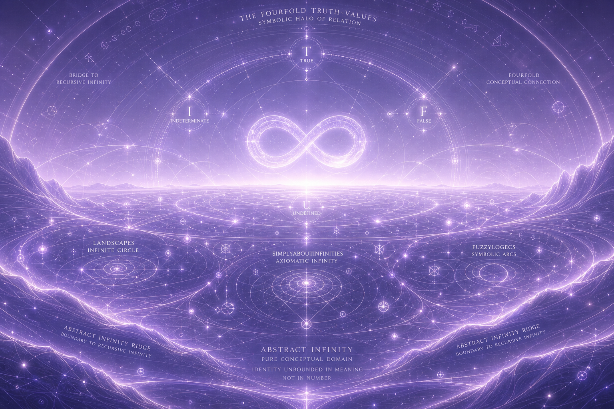

**Laegna-Infinity-Abstract**

## Laegna Atlas — Infinity (Recursive Mode)

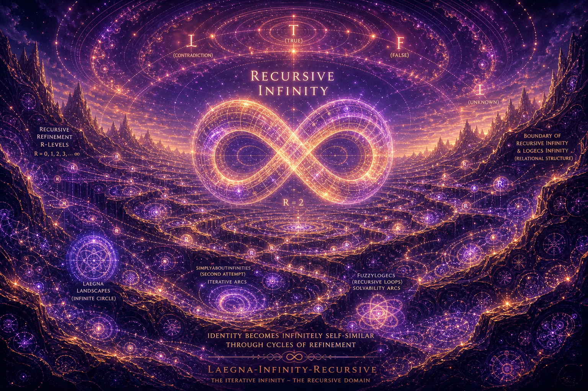

**Laegna-Infinity-Recursive**

## Laegna Atlas — Infinity (Logecs Mode)

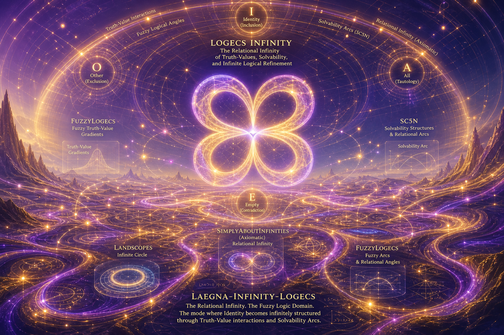

**Laegna-Infinity-Logecs**

## Laegna Atlas — Infinity (Unified Mode)

**Laegna-Infinity-Unified**

## Laegna Atlas — Physical Infinity (Cyclic)

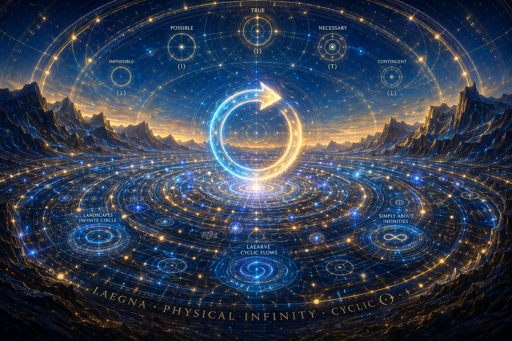

**Laegna-Physical-Infinity-Cyclic**

## Laegna Atlas — Physical Infinity (Directional)

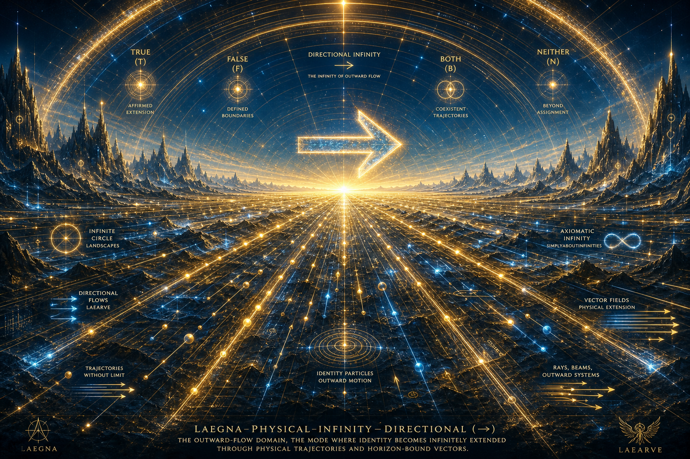

**Laegna-Physical-Infinity-Directional**
