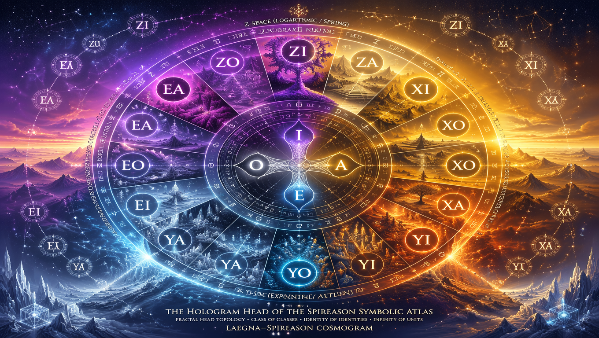
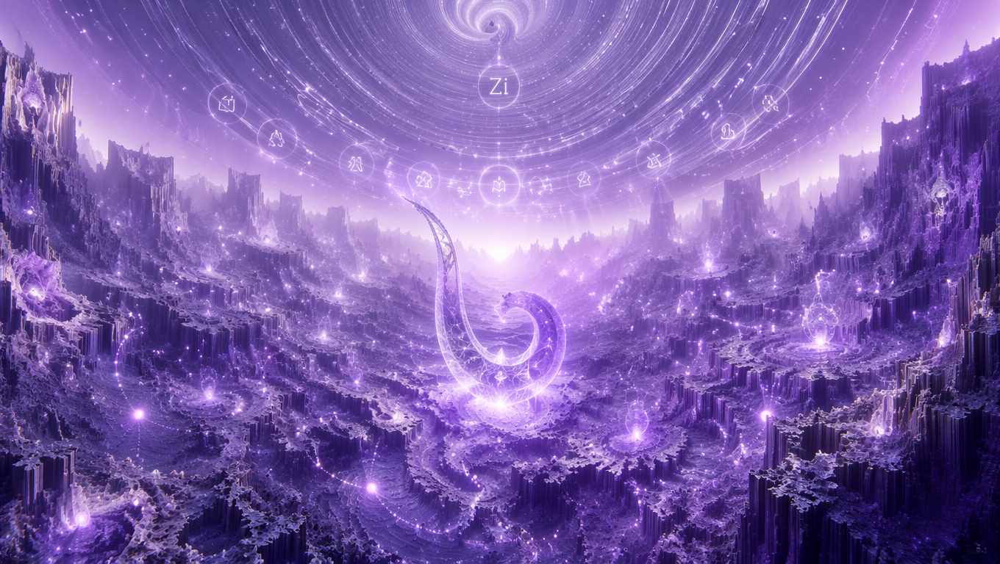
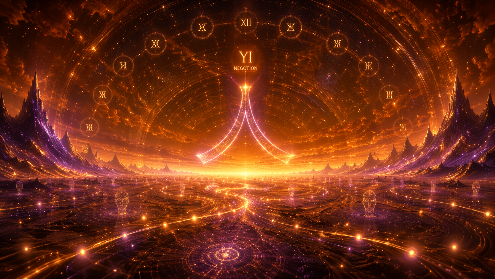
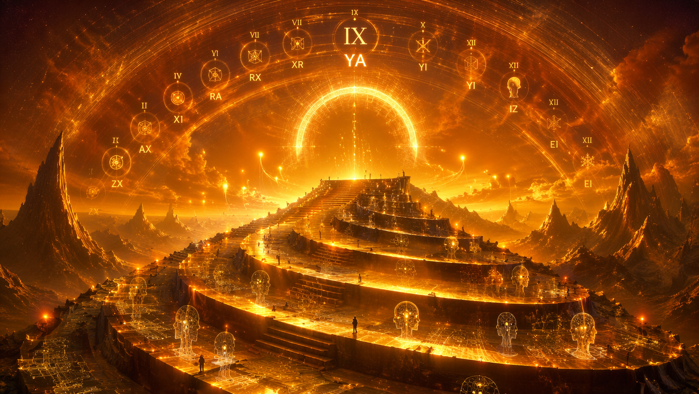

# SpiReason's Atlas

## ZI — Spring of Sub‑Zero Awakening (Logarithmic Negotion)

**ZI‑Spring**

## ZO — Spring of Sub‑Zero Neutrality (Logarithmic Negation)

**ZO‑Spring**

## ZA — Spring of Sub‑Zero Ascent (Logarithmic Position)

**ZA‑Spring**

## XI — Summer of Linear Identity (Negotion in the Linear Domain)

**XI‑Summer**

## XO — Summer of Linear Neutrality (Negation in the Linear Domain)

**XO‑Summer**

## XA — Summer of Linear Ascent (Position in the Linear Domain)

**XA‑Summer**

## YI — Autumn of Exponential Collapse (Negotion in the Exponential Domain)

**YI‑Autumn**

## YO — Autumn of Exponential Neutrality (Negation in the Exponential Domain)

**YO‑Autumn**

## YA — Autumn of Exponential Ascent (Position in the Exponential Domain)

**YA‑Autumn**

## EI — Winter of Exponent‑Stillness (Negotion in the Absolute Domain)

**EI‑Winter**

## EO — Winter of Exponent‑Neutrality (Negation in the Absolute Domain)

**EO‑Winter**

## EA — Winter of Exponent‑Ascent (Position in the Absolute Domain)

**EA‑Winter**

